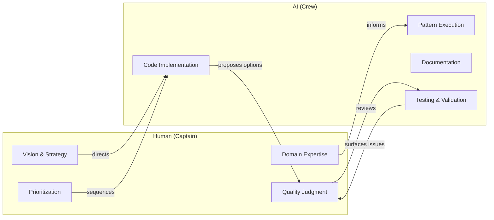
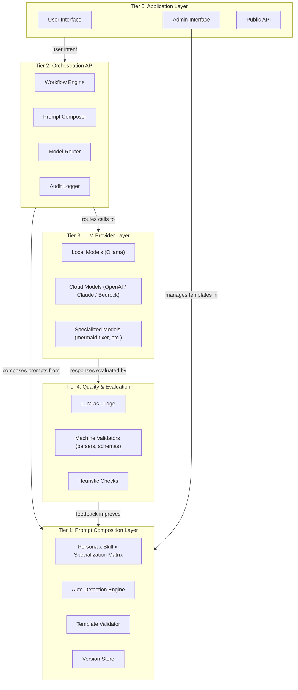
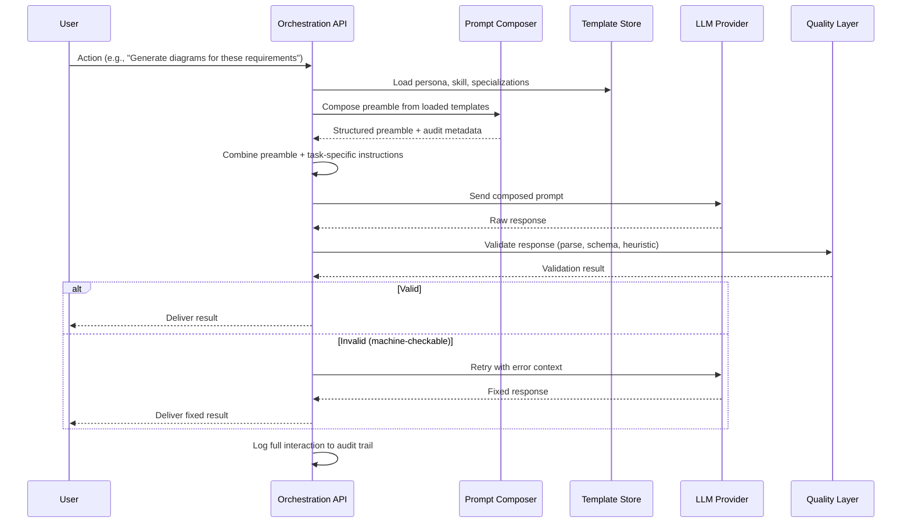
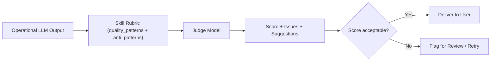
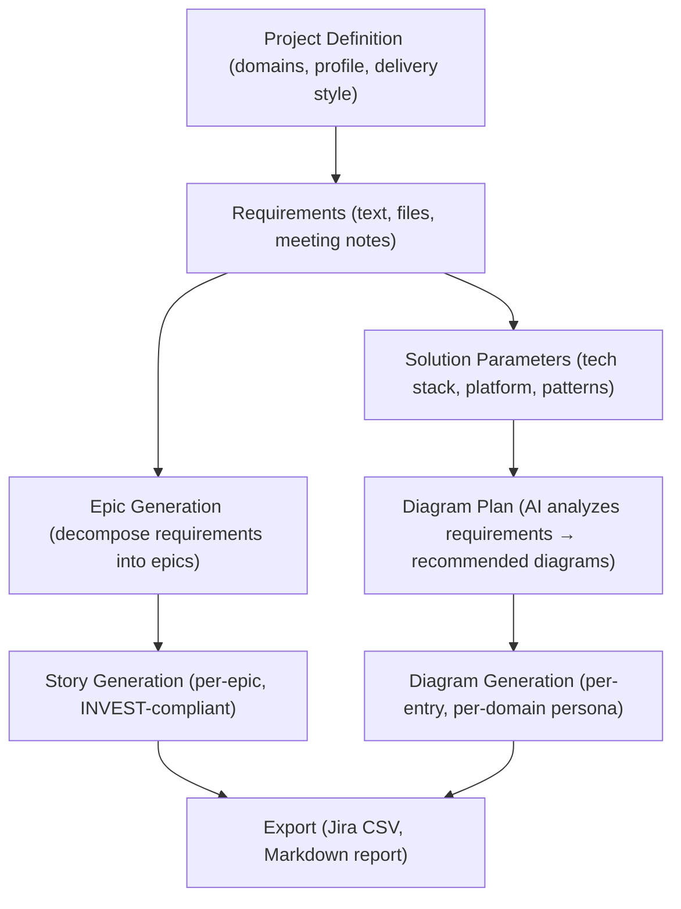

# AI-Assisted Application Architecture — A Blueprint

## From Intelligent Prompts to Complete Applications

This document defines a multi-tiered architecture for building AI-assisted applications. The architecture treats **composed, managed prompts** as the fundamental building block — not raw LLM calls, but structured, validatable, persona-driven prompt pipelines that are woven together through an API layer to form complete user-facing applications.

StoryForge AI is the first implementation of this blueprint. But the blueprint itself is application-agnostic. Any domain that benefits from structured AI generation — legal document drafting, curriculum design, compliance reporting, incident response playbooks — can be built on the same architectural foundation.

---

## The Human Layer: Vision Above All

### The Captain of the Ship

Every architectural decision, workflow design, and strategic direction originates from a human. AI is the crew that executes; the human sets the course. No amount of model capability replaces the lived experience of someone who understands the domain, the users, and the organizational context.

### What the Human Contributes (That AI Cannot)

| Contribution | Role |
|-------------|------|
| **Product vision** | Defines what the application does and who it serves |
| **Workflow design** | Sequences capabilities into coherent user journeys |
| **Domain modeling** | Identifies the personas, skills, and specializations that matter |
| **Quality judgment** | Recognizes when AI output is wrong, weak, or hallucinated |
| **Strategic prioritization** | Decides what to build next based on impact and feasibility |
| **Organizational context** | Understands users, politics, constraints, and what "success" means |

### The Human-AI Partnership Model



**Core principle:** AI amplifies human expertise, it doesn't replace it. Ideas originate from humans. Execution accelerates with AI. The end users are the ultimate judges.

---

## The Blueprint: Multi-Tiered AI Application Architecture

### Tier Overview



---

## Tier 1: Prompt Composition Layer

### Purpose
The single source of truth for *how to talk to LLMs*. All prompt engineering knowledge lives here — not scattered across application code.

### Components

| Component | Responsibility |
|-----------|---------------|
| **Personas** | Define WHO the LLM acts as (domain archetype, concerns, thinking patterns) |
| **Skills** | Define WHAT the LLM produces (output format, validation rules, quality patterns) |
| **Specializations** | Define WHAT PLATFORM expertise to bring (services, constraints, detection keywords) |
| **Associations** | Soft recommendations for which combinations work well together |
| **Model Overrides** | Per-provider/model adjustments (verbosity, formatting, token budget) |
| **Auto-Detection** | Keyword-based inference of relevant specializations from user context |
| **Validator** | Schema enforcement on all template data (prevents corruption) |
| **Version Store** | Timestamped history of every template change (enables rollback) |

### Key Architectural Decision

> Prompts are **data**, not **code**.
>
> They live in YAML files, editable through an admin UI, validated on save,
> versioned with history, and hot-reloadable without restarts.
>
> This means the people who understand the domain (not the developers)
> can tune prompt behavior directly.

### Template Schema (Universal)

Every application built on this blueprint uses the same three-dimensional composition:

```yaml
# Persona: WHO
id: solution_architect
title: "Solutions Architect"
core_concerns: [...]
thinking_patterns: [...]
quality_criteria: [...]

# Skill: WHAT
id: document_generation
output_format: "structured markdown"
validation_level: structural
validation_rules: [...]
quality_patterns: [...]
anti_patterns: [...]

# Specialization: WITH WHAT EXPERTISE
id: healthcare_compliance
services_and_patterns: ["HIPAA", "HL7 FHIR", ...]
constraints: [...]
detection_keywords: [...]
```

The composition is domain-agnostic. Change the personas, skills, and specializations and you have a completely different application — same architecture, different capability.

---

## Tier 2: Orchestration API

### Purpose
Translates user intent into composed LLM calls. Users never see prompts. They interact with workflows; the API handles composition, routing, retries, and logging.

### Components

| Component | Responsibility |
|-----------|---------------|
| **Workflow Engine** | Sequences multi-step operations (analyze → plan → generate → validate) |
| **Prompt Composer** | Combines persona + skill + specialization + task context into a single prompt |
| **Model Router** | Selects the appropriate provider/model based on task type and availability |
| **Retry Logic** | Re-attempts failed generation with progressively simpler prompts |
| **Audit Logger** | Captures full prompt, response, composition metadata, duration, tokens |

### The Composition Pipeline



### Key Architectural Decision

> The API is the **intelligence layer**, not a passthrough.
>
> It doesn't just forward text to an LLM. It composes structured prompts
> from templates, routes to the right model, validates responses, retries
> on failure, and logs everything for evaluation.
>
> This means swapping LLM providers is a configuration change, not a rewrite.

---

## Tier 3: LLM Provider Layer

### Purpose
Abstracted model access. The orchestration layer doesn't know or care whether it's talking to a local 12B model or a cloud-hosted frontier model.

### Provider Types

| Type | Characteristics | Use Case |
|------|----------------|----------|
| **Local (Ollama)** | Free, private, offline-capable, slower | Development, privacy-sensitive data, cost-conscious |
| **Specialized Local** | Fine-tuned or system-prompted for one task | Syntax repair, format compliance |
| **Cloud API** | Fast, high quality, per-token cost | Production quality, complex reasoning |
| **Enterprise** | Managed, compliant, audit-friendly | Regulated industries, data sovereignty |

### Key Architectural Decision

> **Specialized models for narrow tasks, general models for broad reasoning.**
>
> A 12B model with baked-in mermaid expertise (mermaid-fixer) outperforms
> a 70B general model on syntax repair. Route tasks to the right-sized model.
>
> The composition layer ensures every model gets the same structured context
> regardless of its size. Model overrides in templates handle per-model tuning.

---

## Tier 4: Quality & Evaluation Layer

### Purpose
Ensures outputs meet defined standards. Operates at three levels of strictness.

### Validation Levels

| Level | How | Example | Auto-Retry? |
|-------|-----|---------|-------------|
| **Machine** | Deterministic parser/validator | Mermaid syntax, JSON schema, OpenAPI spec | ✅ Yes |
| **Structural** | Rule-based template checks | Story has title + AC + points; NFRs have metrics | ⚠️ Partial |
| **Heuristic** | LLM-as-Judge scoring against rubrics | Architecture covers all domains; threats are specific | ❌ Report only |

### LLM-as-Judge

A stronger model evaluates the outputs of the operational model. The judge uses the same skill definition (quality_patterns, anti_patterns, validation_rules) as its scoring rubric.



### Key Architectural Decision

> **Validation rules are defined alongside the skill, not as separate infrastructure.**
>
> When you create a skill, you define what "good" looks like (quality_patterns),
> what "bad" looks like (anti_patterns), and what's machine-checkable (validation_rules).
> The evaluation layer reads these same definitions as its rubric.
>
> This means adding a new skill automatically adds its evaluation criteria.
> No separate test suite to maintain.

---

## Tier 5: Application Layer

### Purpose
The user-facing implementation. Built on top of the lower tiers. Users interact with workflows, not prompts.

### Design Principles for the Application Layer

1. **Users express intent, not instructions.** They select domains, describe their tech stack, click "Generate." They never write or see a prompt.

2. **The UI is a workflow guide, not a chat interface.** Structured inputs → structured outputs. Each step in the workflow maps to a composed prompt.

3. **Admin manages the prompt engineering.** The Admin UI exposes Tier 1 (templates) for tuning by domain experts, not developers.

4. **Everything is auditable.** Every AI-generated artifact traces back to its composition: what persona was used, what specializations were detected, what model processed it, how long it took.

---

## How StoryForge Implements the Blueprint

StoryForge AI is the first application built on this architecture. Here's how its features map to the tiers:

| Blueprint Tier | StoryForge Implementation |
|---------------|--------------------------|
| **Tier 1** — Prompt Composition | 7 personas, 6 skills, 7 specializations in YAML; Admin UI with validation + versioning |
| **Tier 2** — Orchestration API | FastAPI endpoints: analyze-diagrams, generate-from-plan, generate-epics, generate-stories |
| **Tier 3** — LLM Providers | Ollama (local), OpenAI, Anthropic, Bedrock, mermaid-fixer (specialized) |
| **Tier 4** — Quality & Evaluation | Mermaid parser, story schema checks, audit logging, replay endpoint |
| **Tier 5** — Application | React UI: Project Definition → Requirements → Diagrams → Epics & Stories → Export |

### StoryForge-Specific Workflow



---

## Applying the Blueprint to Other Domains

The same architecture applies anywhere you need AI to generate structured outputs from domain-specific inputs:

| Application | Personas | Skills | Specializations |
|-------------|----------|--------|-----------------|
| **Legal Document Drafting** | Corporate Lawyer, IP Attorney, Contract Specialist | Contract generation, clause writing, risk analysis | Jurisdiction (US, EU, UK), Industry (healthcare, finance) |
| **Curriculum Design** | Instructional Designer, Subject Expert, Assessment Specialist | Lesson planning, rubric creation, standard alignment | Grade level, Subject area, Pedagogy (PBL, DI) |
| **Incident Response** | SOC Analyst, IR Lead, Forensics Specialist | Playbook generation, timeline construction, IOC extraction | Platform (AWS, Azure), Attack type (ransomware, phishing) |
| **Compliance Reporting** | Compliance Officer, Auditor, Risk Analyst | Control mapping, evidence collection, gap analysis | Framework (SOC2, HIPAA, FERPA, PCI-DSS) |

Each of these would use:
- The same Tier 1 (YAML templates with personas × skills × specializations)
- The same Tier 2 (orchestration API with composition + routing + logging)
- The same Tier 3 (pluggable LLM providers)
- The same Tier 4 (validation + LLM-as-Judge)
- A different Tier 5 (domain-specific UI and workflows)

---

## Strategic Outcomes

### For Product Teams
- No prompt engineering required — express intent through structured UI
- Consistent, domain-aware AI outputs every time
- Customizable through Admin UI without developer involvement

### For Organizations
- Model-agnostic — swap providers without changing workflows
- Cost-optimizable — route tasks to right-sized models
- Quality-measurable — rubric-based scoring, audit trails, trend analysis
- Knowledge institutionalized — expertise lives in templates, not in people's heads

### For Engineering
- Testable at every tier — parsers, schemas, rubrics, replay
- Traceable — full audit with git SHA, composition metadata, responses
- Extensible — 5 minutes to add a persona, skill, or specialization
- Reversible — version history and one-click rollback

### For the Industry
- A reusable pattern for AI-assisted application development
- Proves that small models + precise composition > large models + vague prompts
- Demonstrates that prompt engineering is a *data management* problem, not a *code* problem

---

## Roadmap

| Phase | Capability | Status |
|-------|-----------|--------|
| ✅ | Persona × Skill × Specialization composition engine | Shipped |
| ✅ | YAML templates with admin UI, validation, versioning | Shipped |
| ✅ | Auto-detection of specializations from project context | Shipped |
| ✅ | Mermaid-fixer specialized model (Ollama) | Shipped |
| ✅ | Full audit trail with composition metadata | Shipped |
| ✅ | Soft associations between personas, skills, specializations | Shipped |
| 🔄 | Requirements Gap Analysis skill | Next |
| 🔄 | LLM-as-Judge evaluation endpoint | Next |
| 🔄 | Story generation with composed prompts | Next |
| 📋 | Provider/model-specific template wizard | Planned |
| 📋 | Automated nightly evaluation pipeline | Planned |
| 📋 | Quality dashboards with trend analysis | Planned |
| 📋 | Fine-tuned models per skill (QLoRA specialization) | Planned |
| 📋 | Blueprint SDK for new domain applications | Future |

---

*Document version: 2026-08-11*
*Architecture: Peter Doyle*
*Implementation: Kiro AI*
