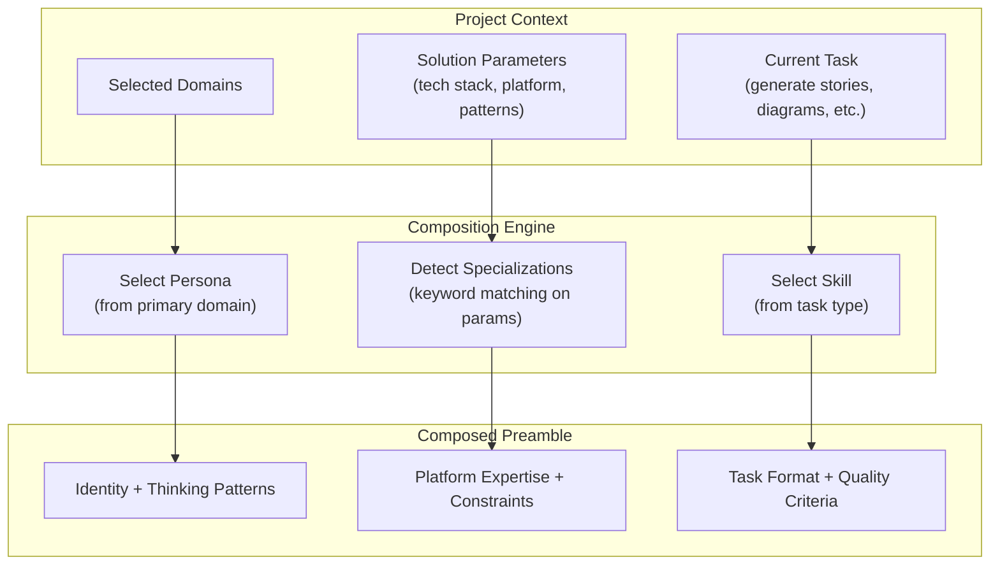
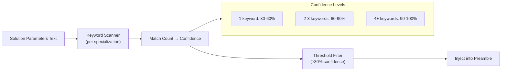

# StoryForge AI — Persona × Skill × Specialization Matrix

**Version:** 0.5.0  
**Date:** August 2026

---

## Overview

StoryForge uses a three-dimensional composition system to shape every LLM call. Each dimension is independent and combinable:

| Dimension | Purpose | Count |
|-----------|---------|:-----:|
| **Personas** | Who the LLM is (professional identity) | 7 |
| **Specializations** | What platform expertise it applies | 8 |
| **Skills** | What artifact it's producing | 7 |

The system composes one persona + zero-or-more specializations + one skill into a prompt preamble that precedes every LLM call.



---

## Personas

Each persona maps 1:1 to a Work Stream Domain. The primary domain selected for a project determines the lead persona.

| ID | Title | Core Focus |
|----|-------|-----------|
| `software_engineering` | Software Architect / Engineer | System decomposition, APIs, testing, resilience |
| `infrastructure_ops` | Site Reliability Engineer / Cloud Architect | Network topology, deployment, monitoring, DR |
| `enterprise_architecture` | Enterprise Architect | Integration patterns, governance, portfolio, buy-vs-build |
| `infosec` | Security Architect / Engineer | Threat modeling, IAM, encryption, compliance |
| `data_engineering_bi` | Data Engineer / BI Architect | Pipelines, data quality, schema evolution, analytics |
| `machine_learning_ai` | ML / MLOps Engineer | Model training, serving, drift monitoring, responsible AI |
| `product_owner` | Product Owner / Business Process Analyst | Value streams, process flows, stakeholder alignment |

### Persona Structure

Each persona provides:
- **Core Concerns** — What this expert cares about (injected as "YOUR CORE CONCERNS")
- **Vocabulary** — Domain-specific terms the LLM uses naturally
- **Thinking Patterns** — How this persona approaches problems (injected as "HOW YOU APPROACH PROBLEMS")
- **Quality Criteria** — What "good" looks like from this perspective

---

## Specializations

Specializations add platform-specific expertise. They're **auto-detected** from solution parameters text via keyword matching, or can be manually overridden.

| ID | Name | Detection Trigger Examples | Confidence Threshold |
|----|------|--------------------------|:--------------------:|
| `aws` | Amazon Web Services | "aws", "lambda", "s3", "dynamodb", "ecs" | 30%+ |
| `azure` | Microsoft Azure | "azure", "aks", "cosmos db", "entra id" | 30%+ |
| `gcp` | Google Cloud Platform | "gcp", "bigquery", "cloud run", "pub/sub" | 30%+ |
| `serverless` | Serverless / Event-Driven | "serverless", "faas", "event-driven", "cold start" | 30%+ |
| `kubernetes` | Kubernetes / Container Orchestration | "kubernetes", "k8s", "helm", "service mesh" | 30%+ |
| `agile_scrum` | Agile / Scrum Methodology | "agile", "scrum", "sprint", "user story" | 30%+ |
| `process_automation` | Business Process Automation | "workflow", "automation", "approval chain", "sla" | 30%+ |
| `buy_vs_build` | Buy vs Build Decision Framework | "buy vs build", "vendor evaluation", "tco", "rfp" | 30%+ |

### Specialization Structure

Each specialization provides:
- **Services & Patterns** — Specific tools/patterns to reference (e.g., "Lambda", "SQS", "EventBridge")
- **Constraints** — Rules the LLM must follow (e.g., "Reference specific AWS service names")
- **Examples** — Concrete correct-usage examples
- **Detection Keywords** — Words that trigger auto-detection (30+ per specialization)

### Auto-Detection Flow



---

## Skills

Skills define what artifact the LLM is producing. Each skill specifies output format, validation approach, quality patterns, and anti-patterns.

| ID | Name | Output Format | Validation |
|----|------|---------------|:----------:|
| `mermaid_diagram` | Mermaid Diagram Building | Mermaid code block | Machine (parser) |
| `story_writing` | User Story Writing | Structured story (As a.../I want.../So that...) | Structural |
| `requirements_analysis` | Requirements Analysis | Structured requirements with IDs | Heuristic |
| `requirements_gap_analysis` | Requirements Gap Analysis | JSON gap report | Heuristic |
| `api_design` | API Design | OpenAPI spec or endpoint definitions | Machine |
| `threat_modeling` | Threat Modeling | STRIDE analysis with mitigations | Heuristic |
| `business_process_flow` | Business Process Flow Diagramming | Mermaid flowchart with swimlanes | Machine (parser) |

### Skill Structure

Each skill provides:
- **Output Format** — What the output should look like
- **Validation Level** — How output is checked: `machine` (parser), `structural`, `heuristic`, `human`
- **Validation Rules** — Specific checks (e.g., "Must parse without errors in mermaid.js")
- **Quality Patterns** — What good output looks like (injected as "QUALITY CRITERIA FOR YOUR OUTPUT")
- **Anti-Patterns** — What to avoid (injected as "AVOID THESE ANTI-PATTERNS")

---

## Composition Matrix

The following diagram shows which personas recommend which skills and specializations:

```mermaid
graph TD
    subgraph Personas["Personas (WHO)"]
        SWE["Software\nArchitect"]
        INFRA["SRE / Cloud\nArchitect"]
        EA["Enterprise\nArchitect"]
        SEC["Security\nArchitect"]
        DATA["Data\nEngineer"]
        ML["ML/MLOps\nEngineer"]
        PO["Product\nOwner"]
    end

    subgraph Skills["Skills (WHAT)"]
        MERMAID["Mermaid\nDiagram"]
        STORY["User Story\nWriting"]
        REQAN["Requirements\nAnalysis"]
        GAP["Gap\nAnalysis"]
        API["API\nDesign"]
        THREAT["Threat\nModeling"]
        BPF["Business\nProcess Flow"]
    end

    subgraph Specializations["Specializations (PLATFORM)"]
        AWS["AWS"]
        AZURE["Azure"]
        GCP["GCP"]
        SLS["Serverless"]
        K8S["Kubernetes"]
        AGILE["Agile/Scrum"]
        PROC["Process\nAutomation"]
        BVB["Buy vs\nBuild"]
    end

    %% Persona → Skill associations
    SWE --> MERMAID
    SWE --> STORY
    SWE --> API
    INFRA --> MERMAID
    EA --> MERMAID
    EA --> REQAN
    EA --> BPF
    SEC --> THREAT
    SEC --> MERMAID
    DATA --> MERMAID
    ML --> MERMAID
    ML --> STORY
    PO --> STORY
    PO --> GAP
    PO --> BPF

    %% Persona → Specialization affinities
    SWE -.-> AWS
    SWE -.-> AZURE
    SWE -.-> GCP
    SWE -.-> SLS
    SWE -.-> K8S
    INFRA -.-> AWS
    INFRA -.-> AZURE
    INFRA -.-> GCP
    INFRA -.-> K8S
    EA -.-> AGILE
    EA -.-> PROC
    EA -.-> BVB
    PO -.-> AGILE
    PO -.-> PROC
```



---

## How It Comes Together

### Example: Generating Diagrams for a Cloud Migration Project

**Project Context:**
- Domains: `infrastructure_ops`, `software_engineering`
- Solution Parameters: "AWS ECS Fargate, RDS Aurora, S3, CloudFront, event-driven with SQS"
- Task: Generate architecture diagrams

**Composition Result:**
1. **Persona**: Site Reliability Engineer (primary domain = infrastructure_ops)
2. **Specializations detected**: `aws` (95%), `serverless` (65%)
3. **Skill**: Mermaid Diagram Building

**Resulting preamble:**
```
You are a Site Reliability Engineer / Cloud Architect.
Designs and operates infrastructure for reliability, performance, and cost efficiency.

YOUR CORE CONCERNS:
- Network topology and security boundaries
- Deployment automation and rollback
- Monitoring, alerting, and observability
- Capacity planning and auto-scaling
...

HOW YOU APPROACH PROBLEMS:
- Design for failure — assume any component can go down
- Automate everything that's done more than twice
...

YOUR PLATFORM EXPERTISE:
  Amazon Web Services: AWS cloud platform expertise — services, patterns, Well-Architected Framework.
  Key patterns: Lambda, ECS/Fargate, API Gateway, S3, DynamoDB, RDS/Aurora, SQS/SNS, EventBridge
  • Reference specific AWS service names, not generic equivalents
  • Consider AWS Well-Architected Framework pillars
  • Account for AWS service limits and quotas

  Serverless / Event-Driven: Serverless and event-driven architecture patterns.
  Key patterns: Function-as-a-Service, event sourcing, choreography over orchestration
  • Design for stateless execution
  • Account for cold start latency

CURRENT TASK: Mermaid Diagram Building
Produce valid Mermaid.js diagram code that renders correctly.

QUALITY CRITERIA FOR YOUR OUTPUT:
  ✓ Nodes are named with meaningful labels, not A/B/C
  ✓ Subgraphs represent logical boundaries
  ✓ Edge labels describe the interaction

AVOID THESE ANTI-PATTERNS:
  ✗ Single-letter node names with no context
  ✗ No subgraph grouping in complex diagrams
  ✗ Hallucinated syntax like ::: or note directives
```

---

## File Locations

| Component | Path |
|-----------|------|
| Persona YAML templates | `src/storyforge/templates/prompt_engineering/personas/` |
| Specialization YAML templates | `src/storyforge/templates/prompt_engineering/specializations/` |
| Skill YAML templates | `src/storyforge/templates/prompt_engineering/skills/` |
| Composition engine | `src/storyforge/prompts/composer.py` |
| Specialization detector | `src/storyforge/prompts/specialization_detector.py` |
| Hardcoded fallbacks | `src/storyforge/prompts/persona_skill_matrix.py` |
| Admin UI | Admin → Prompt Templates tab |
| Audit trail | Admin → Prompt Engineering → Prompt Audit Log |
