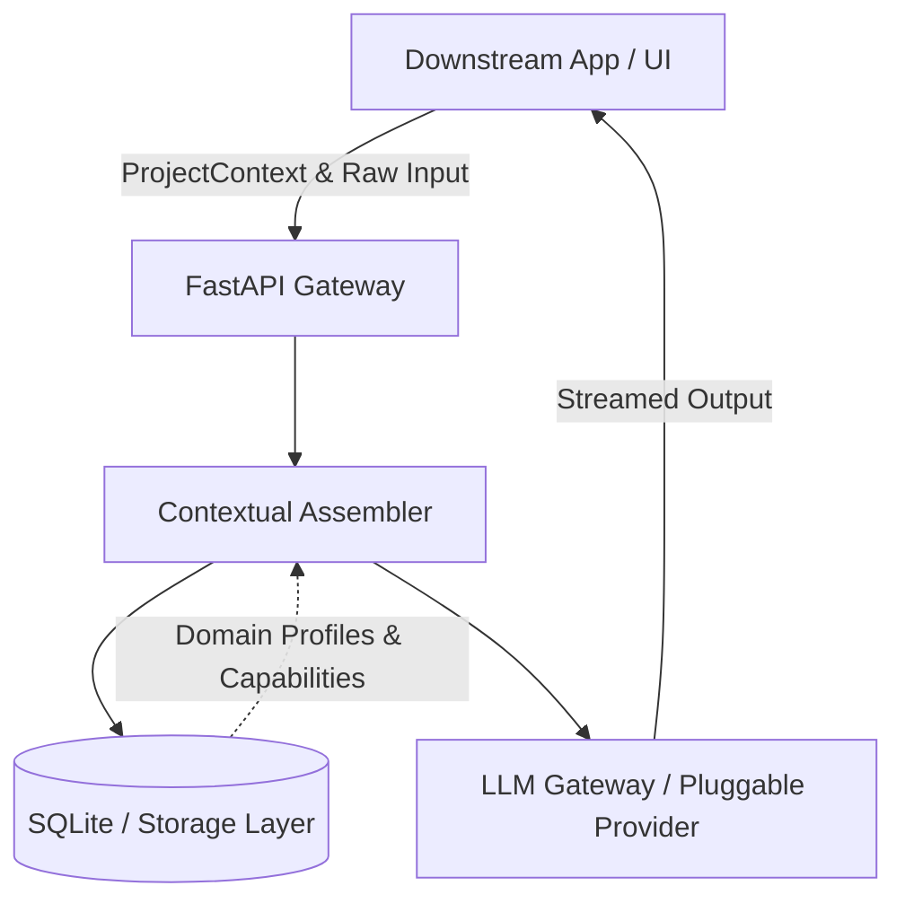
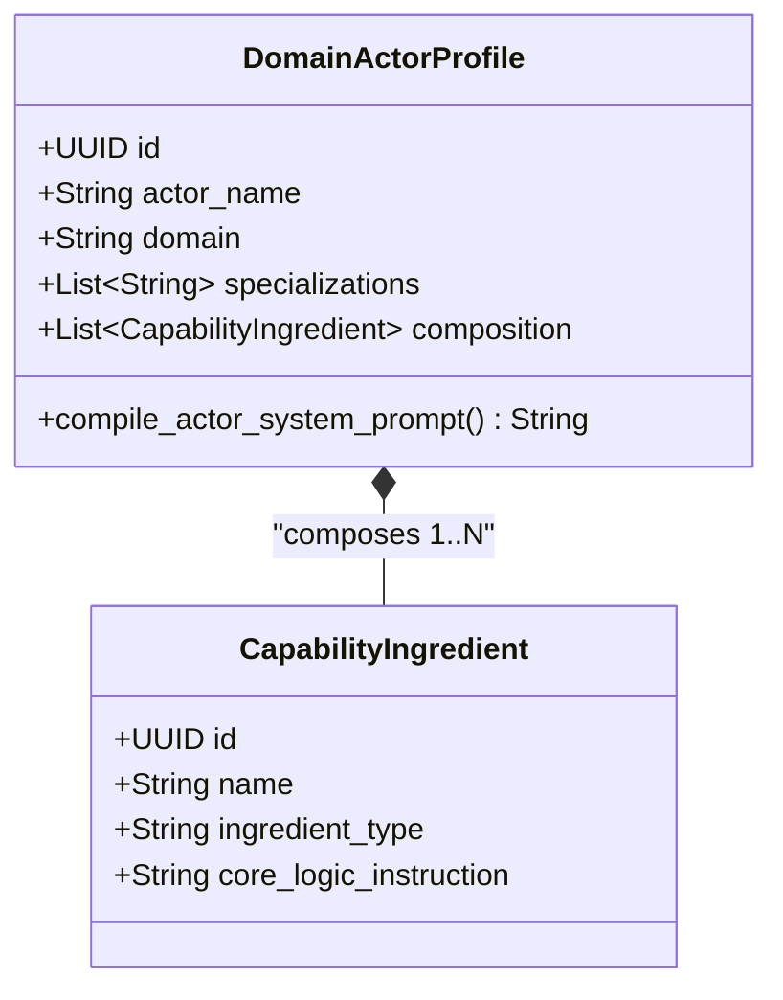

# ActorFactory Architecture

This document describes the core architecture of the ActorFactory Engine.

## System Topology

## Persona × Skill Composition

Based on the StoryForge design, actors are composed dynamically:

The system dynamically merges these capabilities at runtime based on the context request to generate highly constrained and specific instructions for Small Language Models (SLMs).
