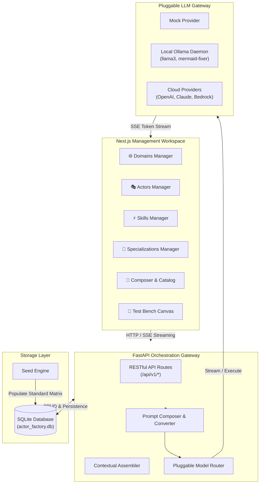
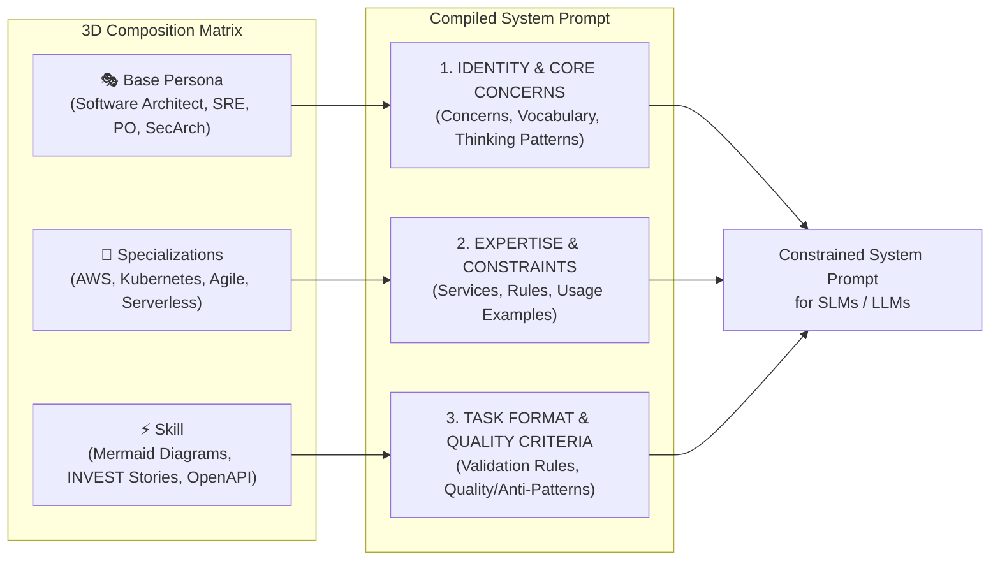

# ActorFactory Architecture 🤖🏭

This document describes the core architecture, data model, composition pipeline, and system topology of the **ActorFactory Engine**.

---

## 🏛️ System Topology

ActorFactory is a universal, domain-agnostic infrastructure layer designed to build, catalog, and orchestrate specialized **Actor Armies** built from atomized capability sets.

---

## 🧬 Persona × Specialization × Skill Composition Matrix

Rather than relying on monolithic, general-purpose prompts, ActorFactory builds dynamic system prompts through a 3D composition formula:

$$\text{Persona (WHO)} \times \text{Specialization (WITH WHAT EXPERTISE)} \times \text{Skill (WHAT)} = \text{Specialized Actor}$$

---

## 🗄️ Core Data Models

| Entity | Purpose | Key Attributes |
|--------|---------|----------------|
| **`Domain`** | Defines operational problem boundaries and context parameters | `name`, `description`, `parameters` (JSON schema/defaults) |
| **`Actor` (Persona)** | Defines professional identity and cognitive approach | `name`, `title`, `description`, `domain_id`, `core_concerns`, `vocabulary`, `thinking_patterns`, `quality_criteria` |
| **`Skill`** | Defines executable capability & output artifact rules | `name`, `description`, `output_format`, `validation_level` (`machine`, `structural`, `heuristic`, `human`), `validation_rules`, `quality_patterns`, `anti_patterns` |
| **`Specialization`** | Defines platform/vendor expertise & detection rules | `name`, `description`, `services_and_patterns`, `constraints`, `examples`, `detection_keywords` |
| **`Composition`** | Named profile linking an Actor, Skills, and Specializations | `name`, `actor_id`, `skill_ids`, `specialization_ids` |

---

## ⚖️ Validation Spectrum & Feedback Chain

Outputs produced by ActorFactory actors undergo multi-tier validation:

| Level | Mechanism | Example | Auto-Retry / Repair |
|-------|-----------|---------|---------------------|
| **Machine** | Binary parser or schema validator | Mermaid.js syntax parser, OpenAPI validator | ✅ Yes (`mermaid-fixer`) |
| **Structural** | Template & schema rules | INVEST user story format, Given/When/Then | ⚠️ Partial |
| **Heuristic** | Rule-based coverage analysis | Domain NFR coverage check | ⚠️ Partial |
| **Human** | Subjective domain judgment | Solution design trade-offs | ❌ Human review |

---

## 📡 API Architecture

- **`GET /api/v1/domains`**, `POST /api/v1/domains`, `DELETE /api/v1/domains/{id}`
- **`GET /api/v1/actors`**, `POST /api/v1/actors`, `DELETE /api/v1/actors/{id}`
- **`GET /api/v1/skills`**, `POST /api/v1/skills`, `DELETE /api/v1/skills/{id}`
- **`GET /api/v1/specializations`**, `POST /api/v1/specializations`, `DELETE /api/v1/specializations/{id}`
- **`GET /api/v1/compositions`**, `POST /api/v1/compositions`, `DELETE /api/v1/compositions/{id}`
- **`POST /api/v1/compose/preview`** — Compiles and previews system prompt in real-time.
- **`POST /api/v1/orchestrate`** — Executes streaming LLM inference via SSE.
- **`POST /api/v1/seed`** — Populates standard specification domain data.

---

## 📚 Deep-Dive AI Engineering Reference Docs

The core principles and research underlying ActorFactory are detailed in the `docs/ai-engineering/` directory:

- [AI Strategy & Blueprint](file:///Users/peterdoyle/Dev/actor-factory/docs/ai-engineering/ai-strategy.md) — Multi-tiered AI application architecture blueprint.
- [Persona × Skill Composition](file:///Users/peterdoyle/Dev/actor-factory/docs/ai-engineering/persona-skill-composition.md) — Validatable AI expertise and validation feedback loops.
- [Persona × Skill × Specialization Matrix Summary](file:///Users/peterdoyle/Dev/actor-factory/docs/ai-engineering/persona-skill-specialization-summary.md) — Matrix dimensions and confidence auto-detection.
- [Prompt Template Definitions](file:///Users/peterdoyle/Dev/actor-factory/docs/ai-engineering/prompt-template-definitions.md) — Full specification catalog of Personas, Skills, and Specializations.
- [Prompt Composition Reference](file:///Users/peterdoyle/Dev/actor-factory/docs/ai-engineering/prompt-composition-reference.md) — Reference guide for prompt preambles and system prompt construction.
- [Specialized Small Models](file:///Users/peterdoyle/Dev/actor-factory/docs/ai-engineering/specialized-small-models.md) — SLM optimization, QLoRA fine-tuning, and model routing.
