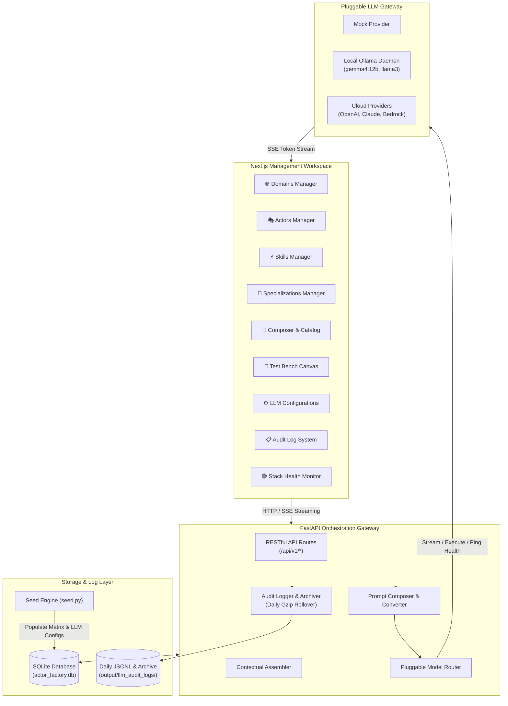
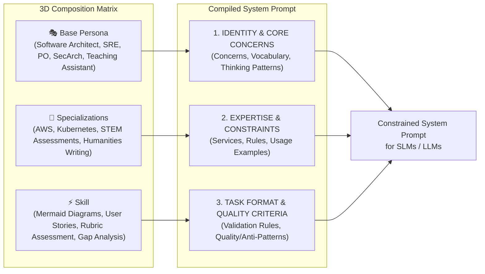

# ActorFactory Architecture 🤖🏭

This document describes the core architecture, data model, composition pipeline, and system topology of the **ActorFactory Engine**.

---

## 🏛️ System Topology

ActorFactory is a universal, domain-agnostic infrastructure layer designed to build, catalog, and orchestrate specialized **Actor Armies** built from atomized capability sets.

---

## 🧬 Persona × Specialization × Skill Composition Matrix

Rather than relying on monolithic, general-purpose prompts, ActorFactory builds dynamic system prompts through a 3D composition formula:

$$\text{Persona (WHO)} \times \text{Specialization (WITH WHAT EXPERTISE)} \times \text{Skill (WHAT)} = \text{Specialized Actor}$$

---

## 🗄️ Core Data Models

| Entity | Purpose | Key Attributes |
|--------|---------|----------------|
| **`Domain`** | Defines operational problem boundaries and context parameters | `name`, `description`, `parameters` (JSON schema/defaults, e.g. `K-12 Education`, `Software Engineering`) |
| **`Actor` (Persona)** | Defines professional identity and cognitive approach | `name`, `title`, `description`, `domain_id`, `core_concerns`, `vocabulary`, `thinking_patterns`, `quality_criteria` (e.g. `Teaching Assistant`, `Software Architect`) |
| **`Skill`** | Defines executable capability & output artifact rules | `name`, `description`, `output_format`, `validation_level` (`machine`, `structural`, `heuristic`), `validation_rules`, `quality_patterns`, `anti_patterns` (e.g. `Rubric-Based Assessment`, `Mermaid Building`) |
| **`Specialization`** | Defines platform/vendor/subject expertise & detection rules | `name`, `description`, `services_and_patterns`, `constraints`, `examples`, `detection_keywords` (e.g. `STEM & Quantitative Assessments`, `Humanities & Subjective Writing`, `AWS`) |
| **`Composition`** | Named profile linking an Actor, Skills, and Specializations | `name`, `actor_id`, `skill_ids`, `specialization_ids` |
| **`LLMProviderConfig`** | Configuration & connection status for an LLM provider | `id`, `name`, `provider_type`, `base_url`, `api_key`, `active_model`, `is_active`, `status`, `available_models` |

---

## 📋 Prompt Engineering Audit & Daily Archiving Engine

The audit logging system records every LLM call with full context for tuning and evaluation:

- **JSONL Storage**: Writes daily entries to `output/llm_audit_logs/YYYY-MM-DD.jsonl`.
- **Auto-Archiving**: Automatically compresses past daily log files into `output/llm_audit_logs/archive/YYYY-MM-DD.jsonl.gz`.
- **On-Demand Decompression**: API range queries (`start_date` -> `end_date`) decompress archived `.jsonl.gz` files in memory without needing disk extraction.
- **Git SHA Tagging**: Every entry includes current `git.sha` and `git.branch`.
- **Call-Type Controls**: Per-type logging controls managed via `/api/v1/llm/audit-logs/config`.

---

## 📡 API Architecture

- **`GET /api/v1/health/stack`** — Checks live health status of API gateway and active LLM provider.
- **`GET /api/v1/llm/audit-logs/search`** — Search audit log entries by date range (`start_date`, `end_date`), `call_type`, search query, and limit.
- **`GET /api/v1/llm/audit-logs/config`**, `PUT /api/v1/llm/audit-logs/config` — Get/update logging controls configuration.
- **`GET /api/v1/llm/configs`**, `POST /api/v1/llm/configs`, `DELETE /api/v1/llm/configs/{id}` — Manages provider configs.
- **`POST /api/v1/llm/test`** — Tests connection, measures latency, and discovers available models.
- **`POST /api/v1/llm/active`** — Sets the active default provider and model.
- **`GET /api/v1/domains`**, `POST /api/v1/domains`, `DELETE /api/v1/domains/{id}`
- **`GET /api/v1/actors`**, `POST /api/v1/actors`, `DELETE /api/v1/actors/{id}`
- **`GET /api/v1/skills`**, `POST /api/v1/skills`, `DELETE /api/v1/skills/{id}`
- **`GET /api/v1/specializations`**, `POST /api/v1/specializations`, `DELETE /api/v1/specializations/{id}`
- **`GET /api/v1/compositions`**, `POST /api/v1/compositions`, `DELETE /api/v1/compositions/{id}`
- **`POST /api/v1/compose/preview`** — Compiles and previews system prompt in real-time.
- **`POST /api/v1/orchestrate`** — Executes streaming LLM inference via SSE (accepts optional `call_type` tag).
- **`POST /api/v1/seed`** — Populates standard matrix & provider data.

---

## 📖 Related Documentation

- 📄 **[Seed Engine & Factory Reset Pattern](file:///Users/peterdoyle/Dev/actor-factory/docs/seed-engine.md)** — Detailed architectural guide on building an idempotent seed engine and factory reset pattern for LLM applications.
