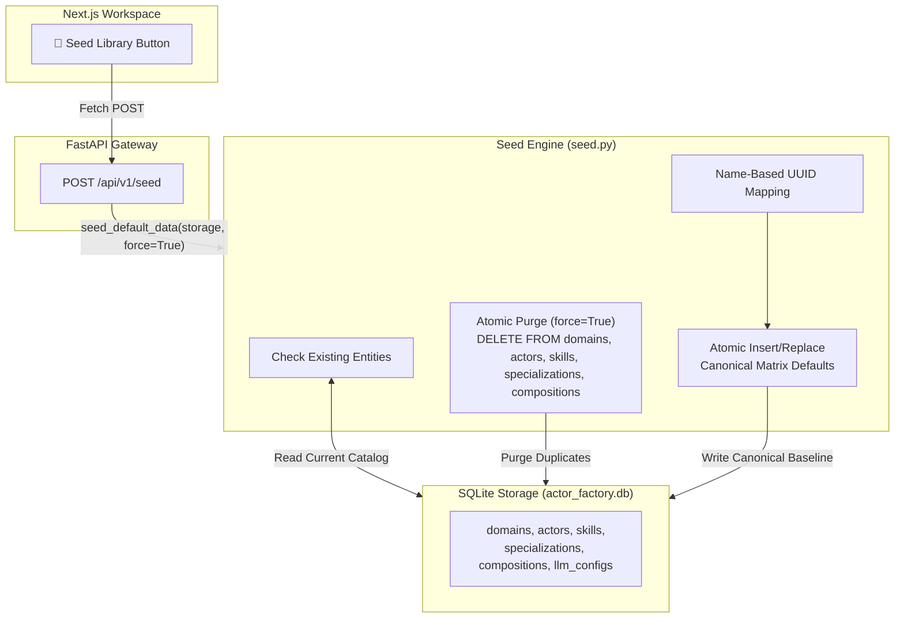

# ActorFactory Seed Engine & Factory Reset Pattern 🏭🌱

This document explains the architectural design, implementation, and reusability of the **Seed Engine & Factory Reset Pattern** in ActorFactory.

---

## 🎯 Purpose & Overview

Catalog-driven AI engines rely on atomized building blocks—such as **Domains**, **Personas (Actors)**, **Specializations**, **Skills**, and **LLM Provider Configurations**. During local development, prompt engineering experiments, or multi-tenant deployments, these catalogs can become cluttered with stale, duplicate, or half-edited entries.

The **ActorFactory Seed Engine** provides a clean, deterministic mechanism to:
1. **Auto-Populate First-Boot Baseline**: Automatically seed default entities on fresh database creation without human intervention.
2. **Perform Full Factory Reset (`force=True`)**: Instantly purge stale/duplicate data and restore canonical baseline catalogs via a single API call or UI click.
3. **Preserve Name-Based Identity**: Prevent duplicate creation by looking up existing entities by name and reusing their assigned UUIDs.

---

## 🏛️ System Architecture



---

## 💻 Code Implementation Walkthrough

### 1. The Seed Engine Core (`src/actor_factory/storage/seed.py`)

The seed engine handles both initial boot auto-seeding (`force=False`) and on-demand factory reset (`force=True`):

```python
from uuid import uuid4
from src.actor_factory.models.core import Domain, Actor, Skill, Specialization, Composition, LLMProviderConfig
from src.actor_factory.storage.sqlite import SQLiteStorage

def seed_default_data(storage: SQLiteStorage, force: bool = False):
    # 1. Seed / Sync LLM Provider Configs
    existing_llm_configs = {c.id: c for c in storage.list_llm_configs()}
    llm_configs = [
        LLMProviderConfig(
            id="ollama_local",
            name="Ollama (Local)",
            provider_type="ollama",
            base_url="http://localhost:11434",
            active_model="gemma4:12b",
            is_active=True,
            status="online",
            available_models=["gemma4:12b", "llama3", "llama3.2", "mistral", "mermaid-fixer"]
        ),
        # ... Additional cloud providers (OpenAI, Anthropic, Bedrock, Mock) ...
    ]

    for cfg in llm_configs:
        if cfg.id not in existing_llm_configs or force:
            storage.save_llm_config(cfg)

    # 2. Check Existing Entities to Prevent Duplication
    existing_domains = {d.name: d.id for d in storage.list_domains()}
    existing_actors = {a.name: a.id for a in storage.list_actors()}
    existing_skills = {s.name: s.id for s in storage.list_skills()}
    existing_specs = {s.name: s.id for s in storage.list_specializations()}
    existing_comps = {c.name: c.id for c in storage.list_compositions()}

    if existing_domains and not force:
        return  # Already seeded; do nothing on normal startup

    # 3. If Force Reset Requested, Purge Duplicate Rows First
    if force:
        with storage._get_connection() as conn:
            cursor = conn.cursor()
            cursor.execute("DELETE FROM domains")
            cursor.execute("DELETE FROM actors")
            cursor.execute("DELETE FROM skills")
            cursor.execute("DELETE FROM specializations")
            cursor.execute("DELETE FROM compositions")
            conn.commit()
        existing_domains, existing_actors, existing_skills, existing_specs, existing_comps = {}, {}, {}, {}, {}

    # 4. Instantiate & Save Canonical Baseline Entities
    domain_se = Domain(
        id=existing_domains.get("Software Engineering", uuid4()),
        name="Software Engineering",
        description="Systems design, API contracts, modularity, and testing strategies.",
        parameters={
            "architecture_style": "microservices",
            "primary_language": "TypeScript / Python",
            "api_style": "REST / OpenAPI 3.0",
            "test_framework": "pytest / vitest"
        }
    )
    domain_edu = Domain(
        id=existing_domains.get("K-12 Education", uuid4()),
        name="K-12 Education",
        description="Classroom instruction, curriculum alignment, student assessment grading, and diagnostic feedback management.",
        parameters={
            "grade_level": "Grade 8",
            "subject_area": "Mathematics & Science",
            "assessment_type": "Mixed Rubric & Problem-Solving Exam",
            "rubric_scale": "4-Point Standards-Based Rubric (1: Beginning, 2: Developing, 3: Proficient, 4: Advanced)",
            "curriculum_standard": "Common Core / NGSS Alignment"
        }
    )

    for d in [domain_se, domain_edu]:
        storage.save_domain(d)
```

---

### 2. FastAPI Gateway Route Endpoint (`src/actor_factory/api/routes.py`)

The API exposes an explicit seeding endpoint and auto-triggers non-destructive seeding on database initial connection:

```python
@router.post("/seed")
def seed_data(storage: SQLiteStorage = Depends(get_storage)):
    seed_default_data(storage, force=True)
    return {
        "status": "success", 
        "message": "Default domains, actors, skills, specializations, and LLM configs seeded."
    }
```

---

### 3. Frontend Trigger UI Button (`frontend/src/app/page.tsx`)

In the Next.js workspace header, a prominent **`🌱 Seed Library`** button allows developers and users to reset the workspace catalog on demand:

```tsx
const handleSeedData = async () => {
  if (!confirm("Seed database with default Domains, Personas, Skills, Specializations, and LLM Configs?")) return;
  try {
    const res = await fetch("http://localhost:8082/api/v1/seed", { method: "POST" });
    if (res.ok) {
      alert("Seed data successfully populated!");
      window.location.reload();
    }
  } catch (e) {
    console.error(e);
    alert("Failed to seed database.");
  }
};
```

---

## 🛠️ Reusing This Pattern in Other Applications

To adapt this pattern to a new application (e.g., *StoryForge AI*, *LogisticsOS*, *EduGrade AI*):

1. **Define Default Data Dictionaries**: Create a dedicated `seed.py` module containing pure-data definitions for your domain's default catalog.
2. **Implement Name-Based ID Resolution**: Always query `existing = {item.name: item.id}` before calling `save()`. If the item exists by name, pass `id=existing[name]` to `INSERT OR REPLACE` to avoid duplicate record insertion.
3. **Add `force=True` Atomic Purging**: Wrap table deletion inside a single SQL transaction block (`with conn: cursor.execute("DELETE FROM ...")`) before re-inserting default rows.
4. **Expose `/api/v1/seed` Endpoint**: Expose an authenticated endpoint for staging or local developer environments.
5. **Add UI Reset Trigger**: Include a visual button in the administration panel to allow quick resets during prompt engineering and QA testing.
